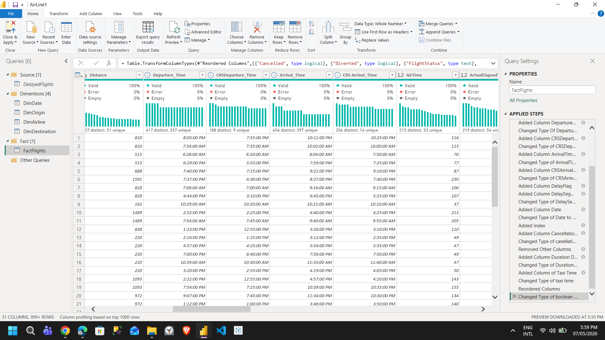
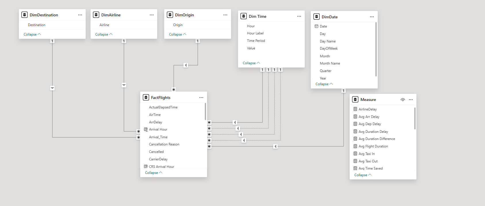
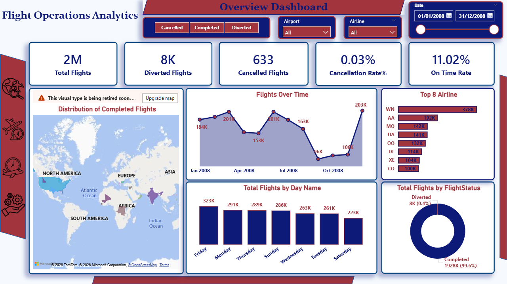
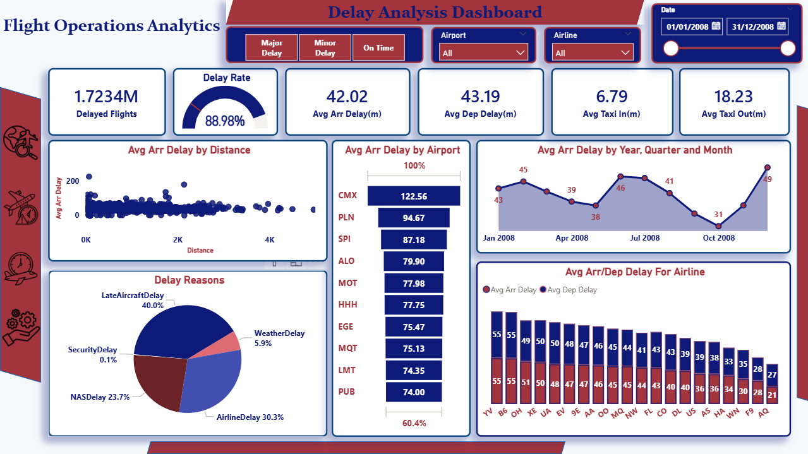
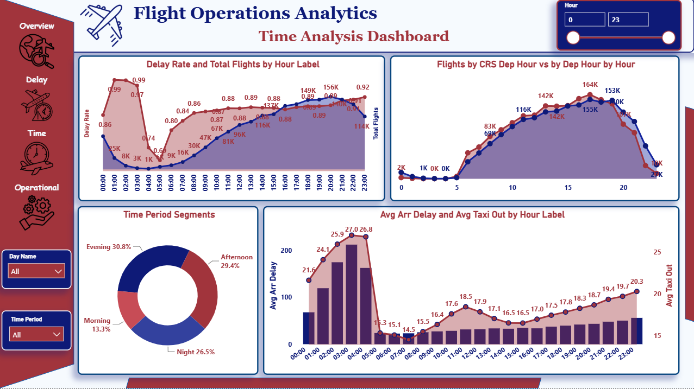
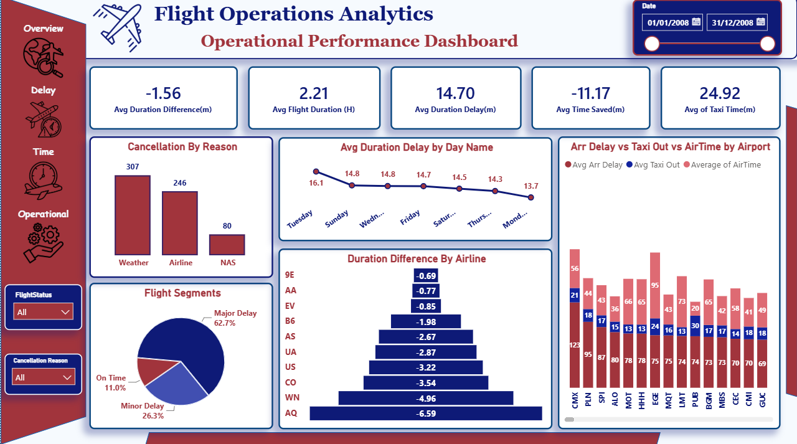

# ✈️ Flight Operations Analytics

An end-to-end Power BI project focused on analyzing airline operations, flight delays, airport congestion, and operational efficiency.

---

## 📌 Project Overview

This project analyzes historical airline operational data to uncover patterns related to:

- Flight delays  
- Airline performance  
- Airport congestion  
- Time-based operational behavior  
- Operational efficiency  

The analysis is presented through **4 interactive dashboards**:

- 📊 Overview Analysis  
- ⏱️ Delay Analysis  
- 🕒 Time Analysis  
- ⚙️ Operational Performance  

---

## 📂 Dataset Description

The dataset contains historical airline operational records, including:

- Airlines  
- Airports  
- Departure & arrival times  
- Flight delays  
- Taxi times  
- Flight durations  
- Cancellation reasons  
- Diversions  

---

## 🔑 Key Columns Used

- ArrDelay  
- DepDelay  
- CarrierDelay  
- WeatherDelay  
- NASDelay  
- LateAircraftDelay  
- TaxiIn  
- TaxiOut  
- ActualElapsedTime  
- CRSElapsedTime  

---

## 🧹 Data Cleaning & Preprocessing

Performed using **Power Query**

### ⏰ Time Formatting

Converted numeric time values into proper time format:

| Raw Value | Converted |
|-----------|----------|
| 754       | 07:54    |
| 56        | 00:56    |
| 2003      | 20:03    |

Cleaned fields:
- DepTime  
- ArrTime  
- CRSDepTime  
- CRSArrTime  

Handled:
- Null values  
- Leading zeros  
- Invalid values (e.g., 2400)  

---

### 🗂️ Missing Values Handling

- Checked null values across key columns  
- Preserved valid operational records  
- Removed invalid entries where necessary  

---

### 🔄 Delay Cause Transformation

Unpivoted delay-related columns:

- CarrierDelay  
- WeatherDelay  
- NASDelay  
- LateAircraftDelay  
- SecurityDelay  

This enabled:
- Dynamic delay analysis  
- Interactive filtering  
- Flexible segmentation  

---

### ❌ Cancellation Codes

| Code | Meaning |
|------|--------|
| A    | Airline |
| B    | Weather |
| C    | NAS |
| D/N  | Security / Other |

---

### 🧠 Feature Engineering

Created additional columns:
- Departure Hour  
- Arrival Hour  
- Time Period  
- Delay Buckets  
- Duration Difference  

---

## 🧩 Data Model

Star-schema design:

- Flights Fact Table  
- Date Dimension
- Time Dimension  
- Origin Dimension
- Destination Dimension  
- Airline Dimension  
and
-Measure Table

Optimized for:
- Time analysis  
- Delay analysis  
- Operational insights  
- Dynamic filtering  

---

# 📊 Dashboards

---

## 📊 1. Overview Analysis

### 🎯 Objective
Provide a high-level view of airline operations.

### 📌 KPIs
- Total Flights: 2M+  
- Diverted Flights: 8K  
- Cancelled Flights: 633  
- Cancellation Rate: 0.03%  
- On-Time Rate: 11.02%  

### 📈 Insights
- Most flights were successfully completed (~99.6%).  
- Traffic concentrated in major hubs.  
- Strong variation across airlines and time periods.  
- Low cancellation and diversion rates overall.  

### 💡 Recommendations
- Monitor high-traffic airports for congestion.  
- Improve load distribution during peak periods.  
- Continue tracking cancellation patterns.  

### 🎛️ Filters
Used to compare flightStatus, airlines, airports, and date periods to understand overall performance.

---

## ⏱️ 2. Delay Analysis

### 🎯 Objective
Analyze flight delays and their causes.

### 📌 KPIs
- Delayed Flights: 1.723M  
- Delay Rate: 88.98%  
- Avg Arrival Delay: 42.02 min  
- Avg Departure Delay: 43.19 min  
- Avg Taxi In: 6.79 min  
- Avg Taxi Out: 18.23 min  

### 📈 Insights
- High delay frequency (~89%).  
- Late Aircraft Delay is the dominant cause.  
- Delay accumulation increases throughout the day.  
- Airport performance varies significantly.  

### 🧠 Delay Causes
- Late Aircraft Delay: 40%  
- Airline Delay: 30.3%  
- NAS Delay: 23.1%  
- Weather Delay: 5.9%  
- Security Delay: 0.1%  

### 💡 Recommendations
- Improve aircraft turnaround time.  
- Reduce delay propagation across flights.  
- Optimize scheduling strategies.  

### 🎛️ Filters
Used to explore delay patterns across airlines, airports, date periods and delay types.

---

## 🕒 3. Time Analysis

### 🎯 Objective
Analyze operational behavior across time periods.

### 📌 KPIs
- Evening Flight Share: 30.8%  
- Night Flight Share: 26.5%  
- Peak Period: Evening  
- Avg Taxi Time: 25+ min  

### 📈 Insights
- Evening is the most congested period.  
- Taxi times increase during peak hours.  
- Delays accumulate throughout the day.  

### 💡 Recommendations
- Reduce evening congestion.  
- Improve runway and taxi management.  
- Balance flight distribution across the day.  

### 🎛️ Filters
Used to analyze hourly trends, peak periods, and flight activity variations over time.

---

## ⚙️ 4. Operational Performance

### 🎯 Objective
Evaluate efficiency beyond delay metrics.

### 📌 KPIs
- Avg Flight Duration: 2.21 hours  
- Avg Duration Difference: -1.56 min  
- Avg Duration Delay: 14.70 min  
- Avg Time Saved: -11.17 min  
- Avg Taxi Time: 24.92 min  

### 📈 Insights
- Moderate operational efficiency overall.  
- Ground operations are main bottleneck.  
- Some flights recover time in-air.  
- Taxi time is a major inefficiency factor.  

### 💡 Recommendations
- Optimize airport ground operations.  
- Reduce taxi congestion.  
- Improve runway traffic flow.  

### 🎛️ Filters
Used to compare operational efficiency across airlines and airports.

---

## 🧩 Interactive Tooltip

A custom tooltip was created and applied to the **Map visualization** to provide quick insights when hovering over each location.

### 📍 Tooltip Content

- Total Flights  
- Cancelled Flights  
- Diverted Flights  
- Delayed Flights  
- Average Flight Duration  
- Delay Rate (%)  

### 💡 Purpose

The tooltip helps users quickly understand the operational performance of each airport without needing to drill down or change pages.

---
## 🛠️ Tools Used

- Power BI  
- Power Query  
- DAX  
- Data Modeling  
- Time Intelligence  

---

## 📌 Final Conclusion

This project transforms raw airline operational data into actionable insights using Power BI.

It highlights:

- Delay patterns  
- Operational inefficiencies  
- Airport congestion issues  
- Time-based behavior  

The analysis demonstrates how data analytics can significantly improve airline and airport operational efficiency.

---

## 👩‍💻 Author

**Yomna Ahmed Hamdy**  
Data Analyst
